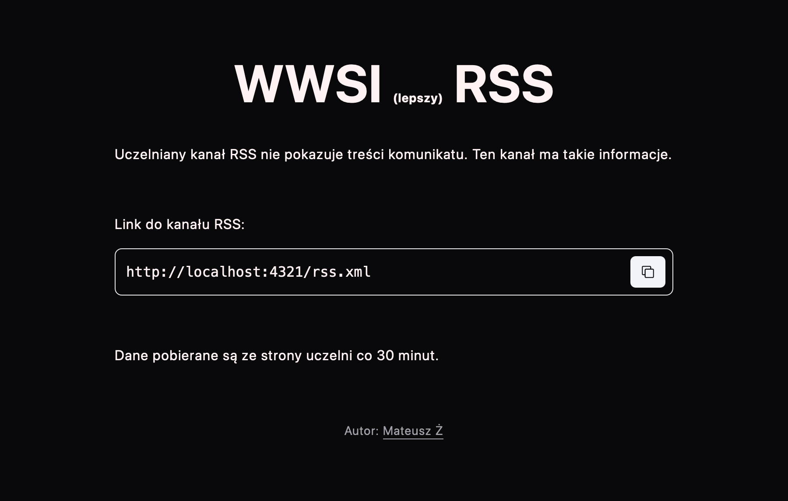

# WWSI RSS



Scrape schools' website and generate better RSS.

## 🤔 How it works?

Application is using credentials from environment variables to login and then session cookie is stored in Redis server.
When someone fetches `/rss.xml`, application uses stored cookie to scrape official website and generate new RSS.

## 🚀 Project Structure

Inside of your Astro project, you'll see the following folders and files:

```text
/
├── public/
│   └── favicon.svg
├── src/
│   ├── layouts/
│   │   └── Layout.astro
│   └── pages/
│       └── api/
│           └── login.ts     <- handles getting session
│           └── news.ts      <- scrapes website
│       └── index.astro
│       └── rss.xml.ts       <- generates rss based on data from /api/news
└── package.json
```


## 🧞 Commands

All commands are run from the root of the project, from a terminal:

| Command              | Action                                           |
| :--------------------| :----------------------------------------------- |
| `bun install`        | Installs dependencies                            |
| `bun dev`            | Starts local dev server at `localhost:4321`      |
| `bunx astro ...`     | Run CLI commands like `astro add`, `astro check` |
| `bunx astro --help`  | Get help using the Astro CLI                     |
| `bun prettier:check` | Checks code formatting                           |
| `bun prettier:fix`   | Fix code formatting                              |


## 🐛 Known issues

1. 'Missing required environment variables `KV_REST_API_URL` and `KV_REST_API_TOKEN`'

Solution: rename file with envvars to `.env.local`